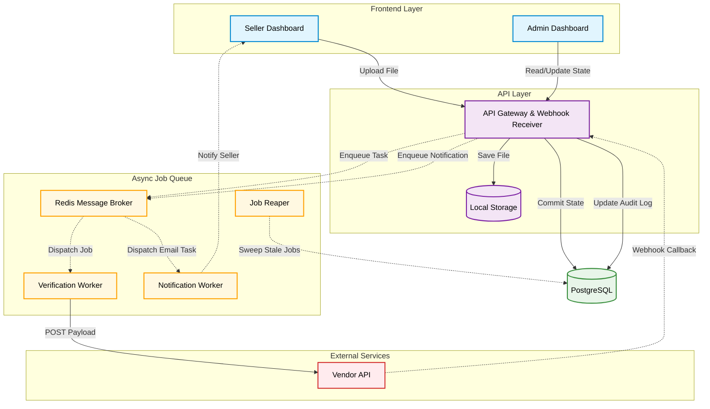
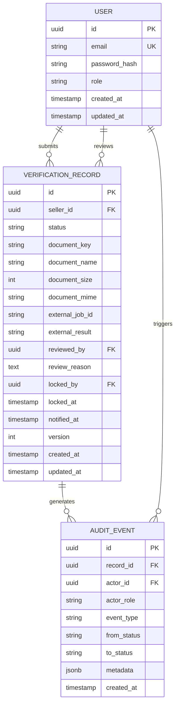
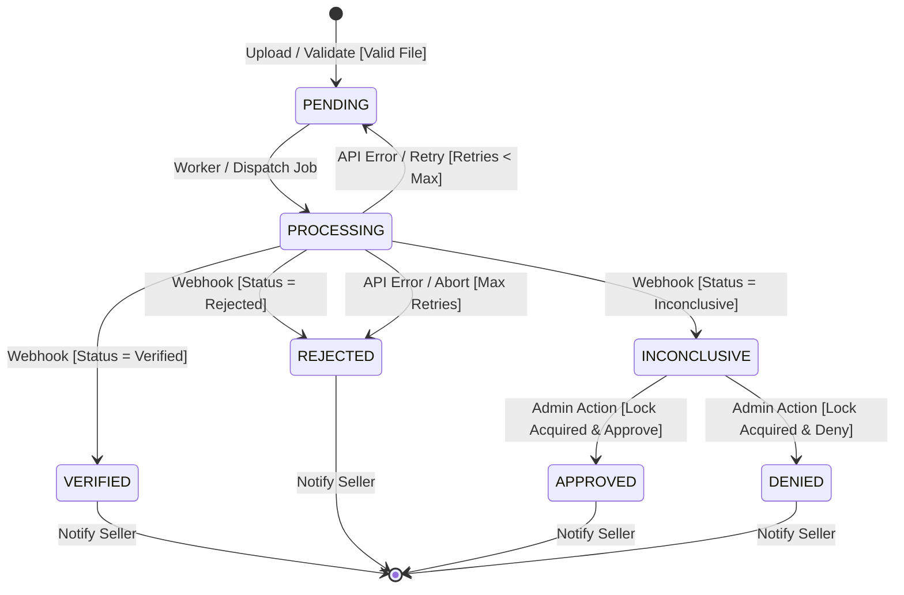

# DESIGN.md — Document Verification Workflow

> **Author:** Senior Full-Stack Engineer  
> **Date:** April 2026  
> **Scope:** End-to-end design for the seller document verification feature on a marketplace platform

---

## Table of Contents

1. [Problem Framing](#1-problem-framing)
2. [Clarifying Questions](#2-clarifying-questions)
3. [Architecture](#3-architecture)
4. [Stack Decisions](#4-stack-decisions)
5. [Trade-offs and Decisions](#5-trade-offs-and-decisions)
6. [Failure Modes](#6-failure-modes)
7. [Descoped Items](#7-descoped-items)
8. [Implementation Plan](#8-implementation-plan)

---

## 1. Problem Framing

### The Real Problem

On the surface, this feature is about routing a document through a verification process. At a deeper level, it solves a trust and liability problem: a marketplace that allows unverified sellers to list products exposes itself to fraud, regulatory non-compliance, and reputational damage. The platform needs a defensible, auditable record that it made a good-faith effort to verify every seller's legitimacy before granting them listing privileges.

This is not merely a UX flow. It is a compliance and risk-management surface dressed in a workflow. Every state transition, every decision made (by a machine or a human), and every notification sent must be durable, attributable, and queryable after the fact. The audit trail is not an afterthought — it is a first-class requirement.

The secondary problem is operational throughput. As the marketplace scales, the ratio of automated resolutions (verified / rejected) to manual reviews (inconclusive) determines how much human labor the operations team absorbs. The system must be designed to maximise the signal-to-noise ratio passed to admins, and to make the admin review task as low-friction as possible.

### Stakeholders and Success Criteria

| Stakeholder | What they care about | Success looks like |
|---|---|---|
| **Seller** | Knowing where they stand and being able to act on feedback quickly | Zero ambiguity about current status; clear next steps if rejected; no unnecessary waiting |
| **Admin / Operations** | Efficient review queue; enough context to make a good decision; accountability for decisions | One-click access to document + history; no two admins tripping over the same record; decisions are logged with identity and rationale |
| **Platform** | Legal defensibility; fraud prevention; a system that does not need babysitting | Complete audit trail; resilience against external service failures; a queue that does not silently stall |

### Explicitly Out of Scope

- Re-verification flows (seller submits a second document after rejection). The current scope covers a single verification attempt per application.
- Document format validation beyond file size and MIME type (no parsing of PDFs, no OCR on the platform's side).
- Multi-document verification (e.g., requiring both a business license and a tax registration).
- Seller appeals or dispute resolution after a final decision.
- The actual third-party verification provider integration. A mock is sufficient.
- Seller account management, onboarding steps beyond document upload, and product listing flows.
- Real-time admin collaboration features (e.g., live cursors, chat).
- SLA enforcement or escalation timers on inconclusive reviews.

---

## 2. Clarifying Questions

Listed in priority order. The top three include working assumptions.

---

**Q1. Is a verification attempt per-application (one shot) or can a seller re-submit after rejection?**

_Why it changes the design:_ This determines whether `VerificationRecord` is a one-to-one relationship with a seller application or a one-to-many. A re-submission model requires versioning the records, tracking which attempt is "current," and deciding whether prior attempts remain visible to the admin. It also changes the state machine (rejected becomes a non-terminal state) and the notification copy.

**Working assumption:** One verification attempt per application. Rejection is terminal for this feature. A re-submission path is a future enhancement.

---

**Q2. What are the file constraints for the uploaded document? (Accepted types, maximum size, retention policy?)**

_Why it changes the design:_ A 10 MB limit for PDFs only is a very different storage and validation strategy than "any file up to 50 MB." Size affects upload handling (multipart vs. streamed), storage tier (local disk vs. object storage), and CDN strategy. Retention policy affects whether files are purged after a final decision, which has GDPR implications. Accepting only PDF vs. accepting images (JPEG, PNG) changes MIME validation logic.

**Working assumption:** Accepted types are PDF, JPEG, and PNG. Maximum file size is 10 MB. Files are retained indefinitely at this stage (retention policy is a future ops/legal concern).

---

**Q3. What does the external verification service's callback mechanism look like? Does it push a webhook, or does our backend poll for a result?**

_Why it changes the design:_ A webhook model means our backend must expose a public callback endpoint, must verify the authenticity of inbound requests (HMAC signature or secret token), and must be idempotent in processing the result (in case of duplicate delivery). A polling model means we need a scheduler or background job that periodically checks a status endpoint, which is simpler to secure but inefficient at scale and harder to make low-latency. This single answer determines a significant portion of the async processing architecture.

**Working assumption:** The mock service accepts a job submission and delivers results via webhook callback to our backend. This is the production-realistic model and the one we design for.

---

**Q4. Should the admin's manual review decision include a mandatory written reason, or is it optional?**

_Why it changes the design:_ Mandatory reasons change the admin UI (a required textarea vs. optional), the data model (nullable vs. non-nullable `review_reason` column), and the notification template sent to sellers. There are also regulatory dimensions: some jurisdictions require that a business rejecting an applicant provide a written reason.

---

**Q5. Is seller notification delivered only via email, or also via in-app notification?**

_Why it changes the design:_ An in-app notification system requires a `Notification` entity, a real-time or polling mechanism, and a UI surface. Email-only is a much simpler integration (a transactional email provider like SendGrid). If both are needed, the notification dispatch layer must fan out to multiple channels and handle partial failures across them.

---

**Q6. Are there SLA requirements on the admin review queue? (e.g., inconclusive documents must be reviewed within 24 hours?)**

_Why it changes the design:_ SLA requirements demand an escalation or alerting mechanism — a background job that detects stale records and either pages the ops team or auto-rejects them after a timeout. Without this, the queue can silently grow indefinitely. It also changes the admin UI (surfacing time-in-queue prominently) and the state machine (adding an `escalated` state or an auto-transition).

---

**Q7. Can more than one admin review the same document simultaneously? If they reach conflicting decisions, whose wins?**

_Why it changes the design:_ Concurrent admin review without optimistic locking produces a last-write-wins race condition, potentially splitting the audit trail. At minimum, a soft lock (claim / assign model) or optimistic concurrency (version field) is needed. If the answer is "only one admin can work a case at a time," a claiming mechanism is appropriate. If multiple admins can review and the last action wins, we need clear UI feedback and the data model must record all actions, not just the final one.

---

**Q8. Does the platform operate across multiple legal jurisdictions with different document requirements or data residency rules?**

_Why it changes the design:_ Multi-jurisdiction support means document type requirements differ by region, verification logic may need to be partitioned, and data residency constraints may prohibit storing certain documents outside specific geographic regions. This would fundamentally change the storage tier (multi-region object storage with appropriate policies) and potentially require routing submissions to different verification providers by region.

---

**Q9. What is the expected volume of new seller applications per day at launch, and what is the 12-month growth projection?**

_Why it changes the design:_ Volume determines whether SQLite is viable or whether Postgres with proper indexing and connection pooling is non-negotiable from day one. It also determines whether a single BullMQ worker suffices or whether we need horizontal scaling of workers and Redis Cluster.

---

**Q10. Should the admin view expose the actual document file for in-browser preview, or only metadata and a download link?**

_Why it changes the design:_ In-browser preview of PDFs and images requires either a signed URL to object storage (correct approach) or proxying the file through the backend (adds load, adds complexity). Serving signed URLs means the frontend talks directly to object storage at render time, which requires CORS configuration on the storage bucket and short-lived URL generation on the backend.

---

## 3. Architecture

### Architecture Diagram

---

### Component Breakdown

**API Gateway (NestJS global middleware)**
Handles authentication guard (JWT verification), role-based access control, request logging, and rate limiting. Centralising these cross-cutting concerns here means individual modules do not re-implement them. Every inbound request passes through this layer.

**Auth Module**
Manages user registration, login, JWT issuance, and refresh token rotation. Issues JWTs with a `role` claim (`seller` or `admin`) which the API Gateway's guard resolves. Stores refresh tokens in Redis with TTL to enable forced logout. Sellers and admins are distinct user roles in a single `User` table — no separate tables, because their authentication flow is identical; only their authorised routes differ.

**Document Verification Module**
The core domain module. Handles document upload (multipart form), persists the `VerificationRecord`, writes the file to object storage, and enqueues the verification job. Exposes a status endpoint for the seller to poll (or for the frontend to call on page load). Also owns the webhook callback endpoint that the mock service hits when it completes.

**Admin Module**
Exposes endpoints for listing all verification records (with filtering by status), claiming a record for review (soft lock), and submitting a decision. Restricted by role guard to `admin` only. Writes `AuditEvent` rows on every state transition.

**Notification Module**
Receives dispatch calls from other modules (via NestJS EventEmitter or direct injection). Composes and sends transactional email. Designed as a side-effectful service rather than a synchronous step in the main flow — failures here do not roll back the verification state transition.

**BullMQ Queue + Verification Worker**
The queue (`verification-jobs`) holds jobs representing pending external verification calls. The worker picks up each job, calls the mock service, and either processes the synchronous response or waits for the async webhook. If the mock is synchronous (for testing), the worker writes the result directly. In the production-realistic async model, the worker submits the job and registers a correlation ID; the webhook callback later resolves the job.

**Mock Verification Service**
A minimal Express or NestJS endpoint (can be a separate module or a separate microservice) that accepts a verification request, waits a random delay (configurable: 500ms–10s for development, potentially longer for realistic simulation), and POSTs a webhook to the backend's callback URL with a random result. This separation means the mock is swappable for a real provider with zero changes to the core domain.

---

### Data Model

**Key design notes on the data model:**

- `users.role` is an enum, not a separate table. Sellers and admins share the same authentication mechanism; routing diverges only at the authorisation layer.
- `verification_records.version` enables optimistic concurrency. Any UPDATE must include `WHERE version = $current_version AND id = $id`. A zero-rows-affected response signals a concurrent modification.
- `verification_records.locked_by` + `locked_at` implement the soft-claim mechanism. Lock expiry (e.g., 10 minutes of inactivity) is enforced at the application layer, not via a DB trigger, so it is auditable.
- `audit_events.metadata` is JSONB rather than a fixed schema. Each event type has a documented shape (e.g., `auto_result` includes `{ confidence_score, raw_response }`), but storing it as JSONB avoids a migration every time a new event type needs extra context.
- `external_job_id` is the correlation ID embedded in the webhook callback from the mock service, used to match the async response to the correct record.

---

### State Machine

**State descriptions:**

| State | Meaning |
|---|---|
| `pending` | Document uploaded, job not yet picked up by worker |
| `processing` | Worker has dispatched the request to the external service; awaiting callback |
| `verified` | External service returned high-confidence valid; seller will be notified approved |
| `rejected` | External service returned high-confidence invalid; seller will be notified rejected |
| `inconclusive` | External service could not determine outcome; awaiting admin review |
| `approved` | Admin reviewed an inconclusive record and approved it |
| `denied` | Admin reviewed an inconclusive record and denied it |

**Guards:**

- `pending → processing`: only if file exists in object storage (prevents processing orphaned records)
- `processing → verified/rejected/inconclusive`: only if webhook HMAC signature is valid and `external_job_id` matches a known record in `processing` state
- `inconclusive → approved/denied`: only if actor has `admin` role; only if `locked_by = actor_id` OR `locked_by IS NULL`; only if `version` matches (optimistic lock)

**Terminal states:** `verified`, `rejected`, `approved`, `denied`. No transitions out of these states in the current scope.

---

## 4. Stack Decisions

### Backend: NestJS (TypeScript)

**Why NestJS:** NestJS provides a modular, decorator-driven architecture that maps naturally to the domain boundaries here (auth, verification, admin, notifications). Its dependency injection container eliminates the boilerplate of manual wiring and makes unit testing straightforward with mock providers. The first-class support for Guards (role-based access), Pipes (validation), and Interceptors (logging, transformation) means cross-cutting concerns are expressible at the framework level rather than in application code. BullMQ has a first-party NestJS integration (`@nestjs/bull`) that reduces integration friction further.

**Alternative considered and rejected: Express + manual structure.** Express is lighter and gives more control, but the gain is illusory at this feature's complexity level. Without a framework-imposed module structure, the codebase tends toward a flat `routes/` + `services/` directory that does not scale cleanly with domain growth. The lack of a built-in DI container means that testing isolation requires manual mock injection or sinon-level hacks. The effort to build what NestJS provides out of the box is not justified for a greenfield project with clearly defined domain boundaries.

---

### Frontend: Next.js (TypeScript)

**Why Next.js:** The seller and admin views have different access patterns. The seller status page benefits from server-side rendering (SSR) for instant, up-to-date status display without a loading spinner. The admin queue benefits from incremental static regeneration (ISR) or client-side fetch with SWR. Next.js supports both patterns in the same app with route-level configuration. Role-based routing (seller routes vs. admin routes) is handled cleanly via Next.js middleware, which can redirect unauthenticated or unauthorised users before the page renders. The App Router's layout system makes a persistent auth shell trivial.

**Alternative considered and rejected: React (Vite SPA) + React Router.** A pure SPA would work, but loses the SSR advantage for the seller status page and requires a separate static hosting setup. More importantly, authentication in a pure SPA must be entirely client-side, which means a flash of unauthenticated content before the redirect fires. Next.js middleware-level auth avoids this entirely.

---

### Database: PostgreSQL

**Why PostgreSQL:** This feature has two characteristics that make relational guarantees non-negotiable. First, state transitions must be atomic — if the status update succeeds but the audit_event insert fails, the record is corrupt. PostgreSQL transactions ensure both writes succeed or neither does. Second, the optimistic locking pattern (`WHERE version = $v`) requires row-level UPDATE semantics that are reliable and well-specified. PostgreSQL's JSONB support for `audit_events.metadata` means we do not need a separate document store for semi-structured event payloads. Its ENUM type provides a database-enforced status vocabulary.

**Alternative considered and rejected: SQLite.** SQLite is excellent for development and low-volume deployments. However, its single-writer model becomes a bottleneck when concurrent admin sessions and background workers are both writing to the database. While WAL mode partially mitigates this, it is not a substitute for proper connection pooling and concurrent-write support in a production setting. The operational overhead of migrating from SQLite to PostgreSQL mid-flight is also higher than starting with PostgreSQL.

**Alternative considered and rejected: MySQL.** MySQL is a viable option, but PostgreSQL's JSONB, its superior enum handling, and its more expressive query planner (particularly for audit log queries involving JSONB metadata filtering) tip the balance. The `pg` ecosystem in Node.js (Drizzle ORM, pg-boss, Postgres.js) is also more actively maintained for this use case.

---

### Async Processing: BullMQ backed by Redis

**Why BullMQ + Redis:** The verification job lifecycle has requirements that go beyond a simple `setTimeout` or an in-process queue: durability (jobs must survive an application restart), visibility (ops should be able to inspect queue depth and job state), retry logic (exponential backoff on external service failures), and concurrency control (multiple workers can process jobs in parallel without double-processing). BullMQ satisfies all four. Redis's atomic operations (RPUSH, BRPOPLPUSH) make BullMQ's job claiming and state transitions race-condition-free. Bull Board (the BullMQ UI) provides immediate operational visibility with zero additional development.

**Alternative considered and rejected: pg-boss.** pg-boss uses PostgreSQL as its backing store, which eliminates Redis as an additional infrastructure dependency. For a project that must run on free-tier hosting, this is genuinely attractive. However, BullMQ outperforms pg-boss at scale because Redis's in-memory data structure operations are orders of magnitude faster than PostgreSQL row locking for queue operations. pg-boss also has a less mature ecosystem for rate limiting and job prioritisation. For this project, the operational cost of a Redis instance (available on every free-tier platform) is acceptable.

**Alternative considered and rejected: In-process queue (simple setTimeout / EventEmitter).** This is the simplest possible approach — no Redis, no worker process, just a setInterval that polls the mock service. However, it offers no durability (jobs are lost on restart), no retry logic that survives a crash, and no horizontal scalability. For a production feature where a verification job represents a real seller waiting for access, silent job loss is unacceptable.

---

## 5. Trade-offs and Decisions

### Decision 1: Async Verification via Webhook Callback Model

**The decision:** The backend submits a verification request to the external service and registers a correlation ID. The external service later POSTs a result to a callback endpoint on our backend. The backend's BullMQ job enters a "waiting for callback" limbo state — it does not hold a connection open.

**Alternatives considered:**

1. _Long-polling from the worker:_ The worker submits the request and then polls a status endpoint on the external service every N seconds until a result arrives. Simple to implement; no public callback endpoint needed.
2. _Synchronous call with extended timeout:_ The worker submits the request and holds the HTTP connection open, waiting for the response (up to minutes).

**Why this path:** The webhook model is the only approach that correctly handles the brief states that says results may take "seconds to hours." A long-polling worker with a minutes-to-hours timeout would tie up a worker thread and consume Redis job queue memory for the duration. A synchronous HTTP connection held for hours is not a serious option (timeouts, load balancer limits, memory). The webhook model decouples submission from result and allows the worker to process other jobs in the interim. The callback endpoint is a lightweight, stateless handler.

**Condition that would change this:** If the external service only supports polling (common with legacy providers), we switch to a scheduled job that polls every 30 seconds with exponential backoff. The state machine remains identical; only the resolution mechanism changes.

---

### Decision 2: Optimistic Locking for Concurrent Admin Reviews

**The decision:** `verification_records` has a `version` INTEGER column, incremented on every UPDATE. Every admin write (claim, decision submit) includes a `WHERE id = $id AND version = $currentVersion` clause. Zero rows affected = concurrent modification detected; return HTTP 409 Conflict to the admin client.

**Alternatives considered:**

1. _Pessimistic locking (SELECT FOR UPDATE):_ Acquire a database row lock at the start of the admin's review session, releasing it on decision submit or session timeout. Guarantees no two admins can simultaneously read-then-write the same record.
2. _Claim / assign model only (soft lock):_ An admin claims a record (sets `locked_by`), which is purely advisory and relies on the UI to hide claimed records from other admins. No DB-level concurrency enforcement.

**Why this path:** Pessimistic locking holds an open database transaction for the duration of an admin's review (which could be minutes). This degrades PostgreSQL connection pool utilisation and creates deadlock risk. The soft-lock claim model (which we do also use, as a UX mechanism to filter the queue) is not sufficient alone — a bug in the UI or a direct API call bypasses it. Optimistic locking adds a lightweight, database-enforced safety net. The 409 response triggers a client-side refetch and re-render, which is a satisfactory UX for a low-frequency conflict.

**Condition that would change this:** If the admin review UI becomes collaborative (multiple admins annotating the same record simultaneously, like a Google Doc), we move to a CRDT or operational transform model. For the current scope, optimistic locking is proportionate.

---

### Decision 3: Append-only Audit Log in a Separate Table

**The decision:** Every state transition writes an `AuditEvent` row to a separate `audit_events` table. The table is append-only by convention (no UPDATEs or DELETEs). The `verification_records.status` field is the current state; `audit_events` is the full history.

**Alternatives considered:**

1. _Event sourcing (reconstruct state from events):_ No `status` column on `verification_records`; the current state is derived by replaying all events for a record.
2. _Status history as JSONB array on the record:_ Append each transition as an element to a JSONB array on the `verification_records` row.

**Why this path:** Full event sourcing is architecturally elegant but operationally expensive for this scale. Querying "all pending records" requires either a materialised view or replaying events per record — both add complexity. The JSONB array approach is harder to query ("show me all records where an admin named X made a decision") and lacks relational integrity. Separating current state (relational, indexed, fast to query) from history (append-only, rich metadata, queryable via JOIN) is the pragmatic middle ground. The audit table is also straightforward to export for compliance reporting.

**Condition that would change this:** If the feature expands to support complex event-driven workflows (e.g., conditional re-verification, automated escalation rules), a proper event sourcing model becomes justified. At that point, the `audit_events` table is already a near-correct event log; the migration path is extracting the reducer.

---

### Decision 4: File Upload Directly to Object Storage via Presigned URL

**The decision:** The backend generates a presigned PUT URL pointing to object storage (S3-compatible). The frontend uploads the file directly from the browser to object storage, then calls the backend's confirm endpoint with the storage key. The backend validates the key (file size, MIME type by inspecting the stored object), creates the `VerificationRecord`, and enqueues the verification job.

**Alternatives considered:**

1. _Multipart upload through the backend:_ Browser POSTs the file to the NestJS API as `multipart/form-data`. The backend receives the bytes, validates them, writes to object storage, then continues.
2. _Base64 in JSON body:_ File is encoded as base64 and included in a JSON POST body.

**Why this path:** Routing large files through the backend doubles bandwidth cost and saturates the API server's memory for the duration of the upload. A 10 MB upload blocking a NestJS worker thread for several seconds under concurrent load is a real throughput problem. The presigned URL pattern offloads file transfer to object storage directly, with the backend acting only as an orchestrator. MIME type validation still happens on the confirmed object (not on the browser's claimed Content-Type header, which is trivially spoofable). Base64 encoding is categorically rejected — it inflates payload size by 33% and provides no benefit.

**Condition that would change this:** If the deployment environment does not support S3-compatible object storage (e.g., a completely self-hosted setup with no external storage), we fall back to multipart upload to the backend with disk or volume-mounted storage. The rest of the architecture is unchanged.

---

### Decision 5: Notification as a Fire-and-Forget Side Effect

**The decision:** After a terminal state transition (verified, rejected, approved, denied), the application layer emits an internal event. The Notification Module handles this event asynchronously. If notification delivery fails, the failure is logged and a retry is scheduled via a BullMQ job, but the main transaction has already committed. `verification_records.notified_at` is set when delivery succeeds. The seller's verification status is final regardless of notification delivery.

**Alternatives considered:**

1. _Notification as part of the main transaction:_ The status update and notification dispatch occur in the same database transaction. If sending fails, the whole transition rolls back.
2. _Synchronous email call in the request handler:_ The API handler awaits the email send before returning 200 to the caller.

**Why this path:** Coupling notification delivery to the state transition transaction means an SMTP timeout rolls back a valid verification decision — an absurd failure mode that leaves the system in an inconsistent state (admin submitted a decision, but the record stays `inconclusive`). Notifications are inherently unreliable external I/O. The only valid handling is: commit the state transition first, then attempt notification with retry logic. The `notified_at` timestamp allows an ops team to identify and manually re-trigger notifications for records that were finalised but never notified.

**Condition that would change this:** If regulators require delivery-confirmed notification before a decision is considered binding (e.g., certain consumer-facing contexts), we need a two-phase model where the decision is in a `pending_notification` state until notification is confirmed. This is rare in B2B marketplace contexts but worth noting.

---

## 6. Failure Modes

### FM1: The External Verification Service Returns a Malformed Response

**What happens:** The mock service (or real provider) returns a 200 with a body that is missing the expected fields, contains an unrecognised `result` value, or is not valid JSON.

**How this design handles it:** The BullMQ worker wraps the response parsing in a try-catch with a strict Zod schema validation. If parsing fails or the result is not one of the expected enum values (`verified`, `rejected`, `inconclusive`), the worker does not update the record. Instead, it throws a structured error, which BullMQ catches and routes to the retry queue. After N retries (configurable, e.g., 3 with exponential backoff), the job is moved to BullMQ's failed queue. A separate monitoring alert fires on jobs entering the failed queue. An ops engineer then manually inspects the raw response payload (stored in `audit_events.metadata` on the job attempt) and decides whether to re-queue the job or manually move the record to a safe state (e.g., `inconclusive` for admin review).

**What we do not do:** Silently move the record to `inconclusive` on parse failure. This would hide provider-side bugs and make the audit trail misleading. Failing loudly is preferable.

---

### FM2: The External Verification Service is Unreachable for Hours

**What happens:** The provider has an outage. All webhook calls time out. Jobs accumulate in `processing` state with no resolution.

**How this design handles it:** BullMQ's retry mechanism with exponential backoff (e.g., 30s, 2m, 10m, 30m, 1h) means the worker continues attempting re-submission without hammering the service. The backoff also provides a natural circuit-breaker effect — during a 1-hour retry window, the worker is not consuming resources on hopeless attempts. A Bull Board dashboard (or equivalent monitoring) surfaces the growing failed/retrying queue depth, alerting ops. Records stay in `processing` state. Sellers polling their status see "Processing" — the UI should set expectation that verification may take "up to 24 hours." We do not auto-reject on timeout because that would falsely penalise sellers for an infrastructure failure outside their control. An SLA timer (outside current scope) would eventually escalate these to admin review.

---

### FM3: A Seller Uploads a 50MB PDF

**What happens:** The seller attempts to upload a file far exceeding the 10 MB limit.

**How this design handles it (layered defence):**

1. _Frontend validation (first line, not trusted):_ The browser checks file size before generating a presigned URL request. If `file.size > 10_000_000`, the upload is blocked with an inline error. This is UX, not security.
2. _Backend presigned URL generation:_ When the backend generates the presigned PUT URL, it embeds a `Content-Length-Range` condition (supported by AWS S3 and compatible services). This means the object storage service itself will reject an upload exceeding 10 MB with a 400, before our backend is involved.
3. _Backend confirm endpoint:_ Even if somehow a large file lands in storage, the confirm endpoint reads the stored object's `ContentLength` metadata and rejects the confirmation request, then issues a storage delete.

This defence-in-depth means no large file ever reaches the backend's memory or gets linked to a `VerificationRecord`.

---

### FM4: Two Admins Attempt to Review the Same Inconclusive Document Simultaneously

**What happens:** Admin A opens the record for review. 30 seconds later, Admin B opens the same record. Admin A submits "approve." Admin B submits "deny."

**How this design handles it:**

1. _Soft lock (UX layer):_ When Admin A opens the record detail view, the backend sets `locked_by = A.id`, `locked_at = now()`. The admin queue list view filters out locked records (or marks them visually as "in review"). Admin B sees the record as locked and is deterred from opening it.
2. _Lock expiry:_ If Admin A abandons the tab without submitting, the lock expires after 10 minutes (a background job or checked at read time: `locked_at < now() - interval '10 minutes'`). Admin B can then claim it.
3. _Optimistic lock (enforcement layer):_ When Admin A submits, the UPDATE includes `WHERE version = 1 AND locked_by = A.id`. This succeeds. When Admin B submits (whether through a race or a bug), the UPDATE finds `version = 2` and `locked_by = A.id`, not matching B's stale version. Zero rows updated → backend returns HTTP 409 → frontend shows "This record was already reviewed. Refreshing..." and re-renders with the current state.

The combination of soft lock (prevents accidental concurrent review) and optimistic lock (enforces correctness even if soft lock is bypassed) ensures the audit log records exactly one decision with correct attribution.

---

### FM5: A Notification Email Fails to Send

**What happens:** SendGrid (or the SMTP provider) returns a 5xx error, times out, or the seller's email address bounces.

**How this design handles it:**

1. _BullMQ notification job with retry:_ The notification dispatch is itself a BullMQ job (not a fire-and-forget async call). This means failures are tracked, retried, and visible in Bull Board.
2. _Exponential backoff:_ Retries: 3 attempts, delays: 1m, 5m, 30m. Transient provider errors (overload, rate limit) typically resolve within this window.
3. _Hard bounce detection:_ If the email provider returns a bounce classification (invalid address), the retry is skipped. The `audit_events` row records the bounce reason.
4. _Operator visibility:_ Records with `notified_at IS NULL` and a terminal status, older than a configurable threshold (e.g., 2 hours), appear in an ops monitoring query. An admin can manually trigger a re-notification from the admin panel (future feature) or investigate the cause.
5. _The verification decision is not reversed:_ A notification failure does not change the `verification_records.status`. The seller can always poll their status page to discover the outcome even without an email.

---

### FM6: Redis Becomes Unavailable (BullMQ Backing Store Loss)

**What happens:** Redis goes down. BullMQ cannot enqueue new jobs. In-flight jobs may have their state lost (Redis is ephemeral unless persistence is configured).

**How this design handles it:**

1. _Redis persistence:_ Redis is configured with AOF (Append-Only File) persistence so the job queue survives a restart.
2. _Graceful API degradation:_ The `DocumentVerificationModule` catches `ECONNREFUSED` from the BullMQ client on enqueue and returns HTTP 503 to the seller's upload request — with a message that the service is temporarily unavailable. This is preferable to silently accepting the upload and losing the job.
3. _Records in `pending` state are re-queueable:_ A recovery script (runnable by ops) queries for records in `pending` state older than N minutes and re-enqueues their jobs. Because the job is idempotent (identified by `external_job_id`), double-enqueue is safe.
4. _Alerting:_ Redis health is monitored; an alert fires within 1 minute of connection loss.

---

## 7. Descoped Items

### Re-submission / Appeal Flow

**Why descoped:** Out of the stated feature scope. Adding it mid-feature would require changing `rejected` from a terminal to a non-terminal state, adding a new `pending_resubmission` or `resubmitted` state, and versioning the documents (which document in which attempt is which?). The added complexity is not proportionate to the initial feature delivery.

**How to add later:** Introduce a `submission_number` on `verification_records`. Allow sellers to initiate a new record (linked to the same `seller_id` but a new row) once a configurable cooldown period has elapsed after rejection. The state machine for each record is unchanged; the seller's aggregate status becomes a function of their latest non-terminal record.

**Risk of descoping:** Sellers who upload an incorrect document have no recovery path. They must contact support to manually intervene, creating operational load.

---

### SLA Enforcement and Admin Queue Escalation

**Why descoped:** Requires a scheduled job that computes time-in-queue per record and triggers escalation events (page ops, auto-reject). This adds complexity to the admin notification system and requires defining SLAs, which is a product decision not yet made.

**How to add later:** A `pg-cron` job or a BullMQ repeatable job that runs every 15 minutes, queries for records in `inconclusive` state older than the SLA threshold, and enqueues escalation notifications. A new `escalated` state can be added to the state machine with a transition from `inconclusive`.

**Risk of descoping:** Without SLA enforcement, the admin review queue is unbounded. A single unavailable admin could block all inconclusive sellers indefinitely. Operationally acceptable at low volume; dangerous at scale.

---

### In-App Notifications (Real-Time Status Push)

**Why descoped:** Implementing a real-time notification surface (WebSockets or SSE) for the seller view adds infrastructure complexity (sticky sessions or pub/sub fan-out via Redis) that is disproportionate to the delivery timeline.

**How to add later:** Use Server-Sent Events (SSE) on the seller status endpoint. The backend pushes a status change event when `verification_records.status` changes. A Redis pub/sub channel (one per `verification_record.id`) carries the event from the API instance that processed the callback to the API instance holding the SSE connection. This is a clean incremental addition.

**Risk of descoping:** Sellers who keep their status page open do not see real-time updates. They must manually refresh. Tolerable for a low-urgency flow where verification takes hours.

---

### Multi-Document Support

**Why descoped:** The data model supports only one document key per `VerificationRecord`. Supporting multiple documents (e.g., business license + tax certificate) requires a separate `verification_documents` table with a foreign key to `verification_records`.

**How to add later:** Extract `document_key`, `document_name`, `document_size`, `document_mime` from `verification_records` into a `VerificationDocument` table (1:N). The upload flow accepts multiple files; the verification worker submits all of them in a single job. This is a straightforward schema migration with a corresponding API change.

**Risk of descoping:** Some jurisdictions or business categories require multiple documents. These sellers cannot complete verification with the current system.

---

### Rate Limiting on Upload Endpoint

**Why descoped:** A global rate limiter is in scope (NestJS Throttler), but per-seller rate limiting on the upload endpoint (to prevent upload spam or abuse) is a more granular concern that requires Redis-backed rate limit tracking per user ID.

**How to add later:** Add a `@Throttle({ upload: { limit: 5, ttl: 3600 } })` decorator to the upload endpoint, backed by the Redis store already in the stack. Trivial to add post-launch.

**Risk of descoping:** A malicious seller or a buggy client could flood the upload endpoint, consuming object storage space and queueing thousands of verification jobs. Mitigated partially by the 10 MB file size limit and the general rate limiter.

---

## 8. Implementation Plan

Assumes a 2-week sprint with one full-stack engineer. Dependencies are noted explicitly.

---

### Phase 1: Foundation (Days 1–2)

**Step 1.1 — Repository setup and tooling** _(2h)_
Monorepo scaffold (Turborepo or npm workspaces), TypeScript configs, ESLint + Prettier, Husky pre-commit hooks, `.env.example`. No external dependencies yet.

**Step 1.2 — Database schema and migrations** _(3h)_
Set up Drizzle ORM (or TypeORM) with PostgreSQL. Write migrations for `users`, `verification_records`, `audit_events`. Seed script with one admin and one seller account.

**Step 1.3 — Auth module (NestJS backend)** _(4h)_
`/auth/register`, `/auth/login` endpoints. JWT issuance with `role` claim. Refresh token endpoint backed by Redis. Global JWT guard with role decorator. Unit tests for guard logic.

_Dependency: Steps 1.1, 1.2 must be complete._

---

### Phase 2: Core Verification Flow (Days 3–6)

**Step 2.1 — Object storage setup and presigned URL endpoint** _(3h)_
Configure S3-compatible storage (MinIO for local dev, S3 or Cloudflare R2 for production). `POST /documents/upload-url` returns a presigned PUT URL. `POST /documents/confirm` validates the stored object and returns the storage key.

**Step 2.2 — VerificationRecord creation** _(2h)_
`POST /verifications` accepts the confirmed storage key, creates a `VerificationRecord` in `pending` state, writes an `audit_event`. Returns the record ID to the seller.

**Step 2.3 — BullMQ setup and verification worker** _(4h)_
Redis connection, BullMQ queue configuration, verification job processor. Worker calls the mock service (stub at this stage — hardcoded response), updates record status, writes audit event.

**Step 2.4 — Mock Verification Service** _(2h)_
Separate NestJS module (or standalone Express app). Accepts `POST /verify`, stores the job with a random delay (500ms–5s), POSTs a webhook to `POST /verifications/callback` with a random result and the correlation ID.

**Step 2.5 — Webhook callback endpoint** _(3h)_
`POST /verifications/callback`. Validates HMAC signature (shared secret between mock and backend). Looks up record by `external_job_id`. Applies state transition with optimistic lock. Writes audit event. Triggers notification event. Integration test covering full async path.

_Dependency: Steps 2.1–2.4 in sequence. Step 2.5 requires 2.4._

---

### Phase 3: Admin Module (Days 7–8)

**Step 3.1 — Admin queue endpoint** _(2h)_
`GET /admin/verifications` with filtering by status, pagination. Returns records with seller info and time-in-queue. Restricted to `admin` role.

**Step 3.2 — Document retrieval (signed URL)** _(2h)_
`GET /admin/verifications/:id/document` returns a short-lived signed GET URL for the document. Admin UI uses this to render an inline preview.

**Step 3.3 — Claim and decision endpoints** _(3h)_
`POST /admin/verifications/:id/claim`: sets soft lock. `POST /admin/verifications/:id/decision`: validates claim ownership, validates version, applies `approved` or `denied` transition with optimistic lock, writes audit event, triggers notification. Unit tests for concurrency scenario.

**Step 3.4 — Audit history endpoint** _(1h)_
`GET /admin/verifications/:id/history`: returns all `audit_events` for a record, ordered chronologically.

_Dependency: Phase 2 complete._

---

### Phase 4: Notification Module (Day 9)

**Step 4.1 — Notification worker** _(3h)_
BullMQ notification job. Compose email from template (verified/rejected/approved/denied). Send via SendGrid SDK (or Nodemailer for local dev). Set `notified_at` on success. Retry logic for transient failures.

**Step 4.2 — Internal event wiring** _(1h)_
Wire NestJS EventEmitter events (`verification.finalised`) from verification module and admin module to notification module. Ensures notification dispatch is decoupled from state transition.

_Dependency: Phase 2 and 3 complete._

---

### Phase 5: Frontend (Days 9–11)

**Step 5.1 — Auth pages (login, role-based redirect)** _(3h)_
Login page. On success, decode JWT role claim and redirect to `/seller` or `/admin`. Next.js middleware blocks unauthenticated access to both route groups.

**Step 5.2 — Seller upload and status page** _(4h)_
File picker with client-side size/type validation. Presigned URL upload flow with progress bar. Status polling (`GET /verifications/my`) with status badge. Displays current state and, if terminal, the outcome with reason.

**Step 5.3 — Admin queue and review page** _(5h)_
Paginated list of verification records with status filter tabs. Record detail view: document preview (iframe for PDF, img tag for images, via signed URL), seller info, audit history timeline. Approve/Deny buttons with optional reason textarea. Optimistic UI update with 409 conflict handling.

_Dependency: Phases 2–4 complete._

---

### Phase 6: Testing, Polish, Deployment (Days 12–14)

**Step 6.1 — Integration and E2E tests** _(4h)_
At minimum: one Vitest integration test covering the full `pending → processing → inconclusive → approved → notified` path. One test for the 409 concurrency scenario. Supertest-based API tests for auth guards.

**Step 6.2 — Error handling and input validation audit** _(2h)_
Ensure all endpoints use NestJS Pipes with Zod or class-validator. No raw error objects leaked in 5xx responses. Consistent error response schema.

**Step 6.3 — Deployment** _(3h)_
Backend: Railway or Render (NestJS). Frontend: Vercel (Next.js). Redis: Railway Redis or Upstash. PostgreSQL: Supabase or Railway Postgres. Object storage: Cloudflare R2 (free tier). Set all environment variables. Smoke test the deployed full path.

**Step 6.4 — README and DESIGN.md finalisation** _(2h)_
Accurate "What I built" section. Clear setup instructions. Test credentials. Deployment URL.

---

### Effort Summary

| Phase | Task | Estimate |
|---|---|---|
| 1 | Foundation (repo, DB, auth) | 9h |
| 2 | Core verification flow | 14h |
| 3 | Admin module | 8h |
| 4 | Notification module | 4h |
| 5 | Frontend | 12h |
| 6 | Testing, polish, deployment | 11h |
| **Total** | | **~58h** |

At ~6 focused hours per working day, this maps to approximately 10 working days, fitting comfortably within a 2-week sprint with buffer for unexpected blockers.

---

_End of DESIGN.md_
